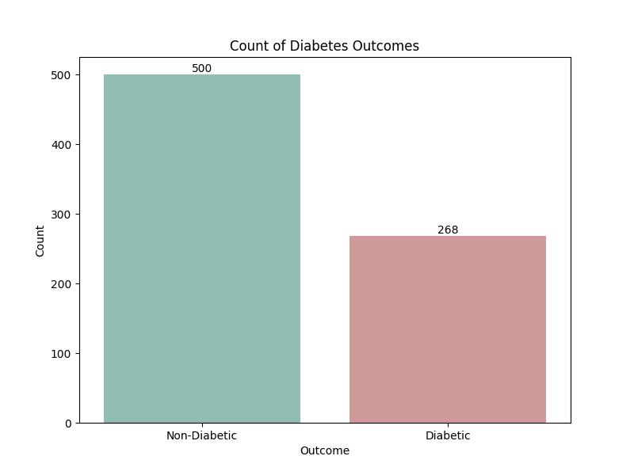

# Pima Indians Diabetes Prediction

## Overview

This project aims to predict diabetes among the Pima Indians based on various health metrics using machine learning models.

### Dataset
The dataset (pima-indians-diabetes.csv) contains the following features:

- **Pregnancies**: Number of times pregnant
- **Glucose**: Plasma glucose concentration after 2 hours in an oral glucose tolerance test
- **Blood Pressure**: Diastolic blood pressure (mm Hg)
- **Skin Thickness**: Triceps skin fold thickness (mm)
- **Insulin**: 2-Hour serum insulin (mu U/ml)
- **BMI**: Body mass index (weight in kg/(height in m)^2)
- **Diabetes Pedigree Function**: Diabetes pedigree function
- **Age**: Age in years
- **Outcome**: Target variable (0 - non-diabetic, 1 - diabetic)
  
### Project Steps

#### Data Cleaning:

- Checked for missing values and duplicates.
- Handled zero values in critical columns.
  
#### Data Exploration:

- Explored data distribution and statistics.
- Visualized key features against the diabetes outcome.
  
#### Feature Selection:

- Selected features based on their impact on the diabetes prediction.
  
#### Model Creation and Evaluation:

Trained several machine learning models including Decision Tree, Logistic Regression, SVM, Random Forest, and K-Nearest Neighbors.
Used GridSearchCV for hyperparameter tuning.
Evaluated models using confusion matrices and classification reports.

#### Results:

- After thorough exploration and evaluation of various machine learning models on the Pima Indians dataset, the K-Nearest Neighbors (KNN) 
demonstrated superior performance in predicting diabetes status with an accuracy of 82%.
- KNN's confusion matrix indicated the highest F1 score for class 1 (70%), highlighting its effectiveness in identifying diabetic cases.

### Visualizations

- Distribution of outcomes, pregnancies, glucose levels, BMI, and other features by diabetes status.
- Heatmap showing correlations between features.
 

  
### Conclusion

- This project demonstrates how machine learning can predict diabetes based on health metrics among the Pima Indians. 
- The insights gained can potentially aid in early diagnosis and intervention.
- Features such as glucose levels, BMI, age, and insulin levels strongly correlate with diabetes status.
- Non-diabetic patients tend to be younger, with lower BMI, and smaller triceps thickness, while diabetic individuals are generally older and have higher BMI and triceps thickness.
- Machine learning models trained on this dataset can effectively predict diabetes status, with features like BMI and glucose playing crucial roles in classification.
